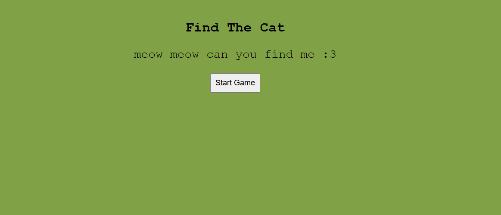
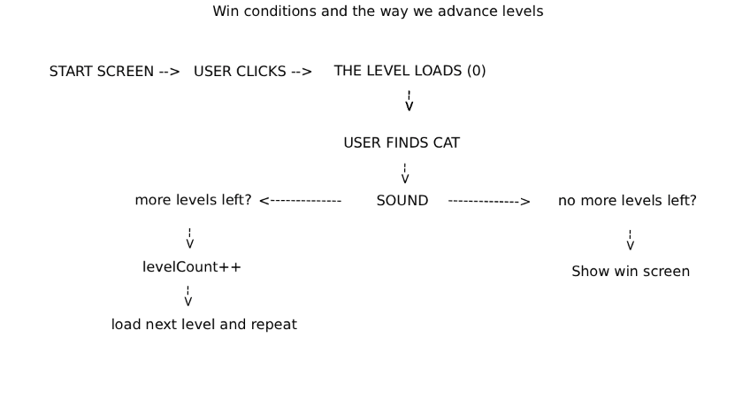

# FindTheCat
Find The Cat is a simple little game in your browser, when you enter it you will see a simple play button you need to click. When you click it you will need to find all of the cats in the images, there are 5 levels total (Web Based)

example picture:

### How does it work?
We have 3 main area we have to cover here:

1 how does the cat hide?
    the levels are wrapped in a container box which is set to be relative and that keeps our background image, the cat on the other hand is absolute and it is layered on top of it. we move it manually
    the cat is (#cat) while the box that keeps the levels is (#gameArea)

2 The level System 
    instead of doing everything in HTML i decided to take the JS approach we use a sort of "blueprint" that contains the title of the level, the custom text image and sound we will use and also the css elements of the cats

3 The win condition and the way we advance levels
    the whole game progresses by listening for user inputs we check by using event listeners

The site starts and the start btn waits for a click once clicked it hides everything and displays the game screen
The level fully loads(background sound level, cat, position)
then if the cat gets clicked a sound starts playing and once the sound is done it loads the next level.
it does this loop until we get to the last level, once we finish the last level we hide everything and show the win screen

### how do i try it? 

You can either download the whole project from here (zip and extract) or go try it here :
> ### [TRY HERE](https://find-the-cat-xi.vercel.app/)
### Features
- Different Levels
- Different Cats
- Different Scenarios
- Win screen
- Start Screen
- custom meows and win music
### What did i learn from this ?
I learned a couple of very important things while building this little web game:
- i learned how to separate data from logic by making a level array 
    `const array = [{ }];`
    which is very important as we dont have to hardcode everything in our HTML, also if i need to add any new levels it will be very easy and i dont even need to touch the HTML part.

- Handling of audio
    I learned how to handle audio on a html page and most importantly learned about the "onended" function which we need it so the code progresses once the audio is over.

- mapping
 i learned how to map using "position relative/absolute" and how they work togheter 

- some CSS styling additions
    i learned what "transform" does ( basically multiplies the size of the object by the amount you want example; "transform: scale(2.0))

### Conclusion
I hope you enjoyed this little project ! have a wonderful rest of your day

